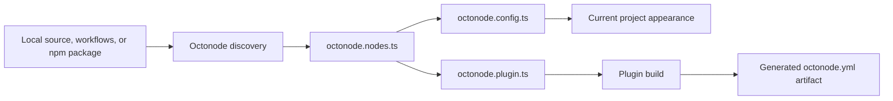

# Typed Octonode authoring files

## Marketplace library imports

Custom integrations are marketplace artifacts, not one npm package per integration.
In `definePlugin`, set `library: { entry: "src/index.ts" }` to expose named public
exports. Link a workflow node to its real library function with
`defineNode(nodes.createIssueNode, { id: "create-issue", libraryExport: "createIssue" })`.
The workflow adapter may accept flattened inputs and host credentials; the library
function keeps its original parameters and explicit connection object.

A node can override the plugin-level source default with
`source: { kind: "npm", package: "jira.js", version: "6.2.0" }`, but only on a
generated npm handle for that exact implementation. Local functions use
`source: { kind: "plugin" }`. The compiler verifies these declarations and derives
all native npm dependencies. Presentation settings cannot redirect executable code.

```sh
octonodes plugin install jira --version <release> --alias jira
octonodes plugin install jira-sdk --version <release>
octonodes plugin update jira --version <release> --dry-run
octonodes plugin update jira --version <release>
octonodes plugin remove jira
```

```ts
import { createIssue } from "@octonodes/plugin/jira";
import { getIssue } from "jira.js/cloud";
```

Only selected custom libraries enter the private generated local package.
Real npm packages are installed by the consuming project's package manager.
Commit `octonode.lock`, `package.json`, and its native lockfile. The disposable
`.octonode-generated/` directory ignores its generated contents automatically;
the existing `.octonode` file is unchanged.

For clean CI, use a separately available **compatible pinned CLI** before installing
the application's dependencies:

```sh
octonodes install --frozen --artifacts-only
npm ci
npm run build
```

Use the equivalent native frozen install for Yarn, pnpm, or Bun. Public cached
artifacts can restore with `--offline --artifacts-only`; private artifacts require
online authorization. `plugin recover` repairs an interrupted native transaction,
preserving post-crash file copies in the reported recovery directory.

The first format supports portable bundled JavaScript with self-contained public
declarations and license notices. Unsupported dynamic imports, external public types,
native addons, and default library exports fail the build. Node 24 on macOS/Linux
is supported; use WSL on Windows. Library imports run with application privileges,
not the workflow permission sandbox. Importing an artifact never starts its IPC runner.

Existing public `@octonodes/plugin` consumers must explicitly opt into migration
with `--migrate`. The source changes here require a new compatible release; existing
published version numbers alone do not imply support.

> **Status:** implemented in the source SDK and devtools. Publishing updated npm packages is a separate release step.

Octonode keeps three concerns separate: discovered code, project presentation,
and a distributable plugin. The generated YAML/JSON remains the runtime and
installation format; users author TypeScript instead of editing that large file.

| File                 | Owner                         | Purpose                                                             | Required                       |
| -------------------- | ----------------------------- | ------------------------------------------------------------------- | ------------------------------ |
| `octonode.nodes.ts`  | Octonode generator            | Typed inventory of discovered functions or npm exports              | Generated when code is scanned |
| `octonode.config.ts` | Project author                | Optional presentation defaults for nodes inside the current project | No                             |
| `octonode.plugin.ts` | Plugin author or npm importer | Select and present public nodes in one distributable plugin         | Only when building a plugin    |

These filenames are reserved. Octonode excludes all three from workflow source
discovery, so definition code can never become an executable workflow node.

Typical file combinations are:

- An existing Octonode project has generated `octonode.nodes.ts` and may add
  `octonode.config.ts` for local appearance.
- Exporting selected project functions or saved workflows adds
  `octonode.plugin.ts`; the plugin reads the generated inventory directly. Saved
  DAG workflows use the existing `octonode plugin from-workflow` export first;
  its package includes a typed inventory and plugin definition.
- Adapting an npm package generates `octonode.nodes.ts` and
  `octonode.plugin.ts`. It does not need `octonode.config.ts` unless the same
  workspace is also used as an interactive Octonode project.

## `octonode.nodes.ts`: generated inventory

This file is the typed bridge between application code and the two authored
files. Octonode generates one stable handle for each discovered local function,
selected npm export, or workflow in a `from-workflow` export package. Handles carry the source identity and
inferred input/output types used by autocomplete and compile-time validation.

A local source inventory contains actual function references:

```ts
// Generated by Octonode. Do not edit.
import { uppercase as node0 } from "./src/text.js";
export const nodes = { uppercase: node0 } as const;
```

Npm and workflow inventories carry the inferred contracts and adapter identities
instead. Their generated content is checked before building.

The exact generated representation is an SDK implementation detail. Authors
only import `nodes`. The file is normally committed so editors and CI have the
same types. `octonodes plugin nodes --check` fails when it is stale or edited.
`octonodes plugin nodes` and local plugin builds regenerate source inventories.
Npm and workflow inventories are regenerated only by their original import/export commands; builds verify their generated content.

For npm packages, the stable identity is the exact module specifier plus export name. This
lets Octonode regenerate inferred types without losing authored presentation.

## `octonode.config.ts`: current-project presentation

This optional file customizes how discovered nodes appear inside the current
project. An empty project definition is valid. A node needs only its generated
handle and the fields the author wants to change:

```ts
import { defineNode, defineProject } from "@octonodes/sdk/project";
import { nodes } from "./octonode.nodes.js";

export default defineProject({
  nodes: [
    defineNode(nodes.uppercase, {
      label: "Make uppercase",
      symbol: "Aa",
      icon: "text-cursor-input",
    }),
  ],
});
```

The discovered definition supplies the ID, contract, and execution target.
Unlisted nodes keep Octonode's built-in presentation. This file cannot select a
publishable plugin, change execution code, or redefine inferred input/output
contracts.

Presentation precedence is:

1. Octonode's inferred or built-in defaults.
2. Defaults in `octonode.config.ts`.
3. Shared project settings.
4. Explicit personal or UI overrides.

Removing a code default therefore does not erase a user's explicit override.

## `octonode.plugin.ts`: distribution boundary

This file defines one independently versioned plugin. It selects nodes from the
generated inventory and gives the external API stable names and presentation:

```ts
import { defineNode, definePlugin } from "@octonodes/sdk/plugin";
import { nodes } from "./octonode.nodes.js";

export default definePlugin({
  id: "text-tools",
  name: "Text tools",
  version: "1.0.0",
  nodes: [
    defineNode(nodes.uppercase, {
      id: "uppercase",
      label: "Make uppercase",
      icon: "text-cursor-input",
    }),
  ],
});
```

The plugin file owns public node selection, stable public IDs, plugin metadata,
permissions, connections, assets, and optional inspector UI. Project-only
presentation does not leak into a published plugin. A package root defines one
plugin; independently versioned plugins use separate package roots.

For workflow nodes, the plugin's `icon` is the default. An `icon` supplied to
`defineNode` overrides it for that node; explicit user presentation overrides
remain highest priority. Without either icon, the renderer uses its normal fallback.

Declare `source: { kind: "plugin" }` when the plugin owns its implementation.
For upstream adapters, declare `source: { kind: "npm", package: "lodash",
version: "<exact inspected version>" }`. The compiler checks this against the
generated inventory and derives `integration.npm`; a mismatched package, version,
or execution source fails the build. Omitting `source` remains compatible with
older definitions: compilation infers it from the selected handles.

Npm authority does not fork or republish the dependency. Consumer code imports
the original package using the module forms it supports. Source indexing recognizes
named imports, including aliases and exact subpaths, against the selected plugin
manifest. Calls remain source-backed: library connection arguments are explicit,
and workflow credential injection is not silently applied to ordinary code.
Namespace/default imports remain ordinary source calls without plugin decoration.

Local function contracts support JSON primitives, literal enums, arrays, finite
object shapes, optional parameters, and async returns. Unsupported contracts such
as `any`, recursive types, classes, and generic or overloaded functions require a
concrete typed wrapper. Project presentation does not impose these plugin contract
limits. Npm adapters retain the existing npm compiler's schemas and warnings.

The build emits the existing artifact:

```text
dist/plugins/text-tools/
  octonode.yml
  runner files
  assets
  integrity metadata
```

The generated manifest remains compatible with the existing loader,
marketplace, and installations. `octonode.yml`, `octonode.yaml`,
`octonode.json`, and legacy `octonode.plugin.json` remain readable inputs for
existing plugins. There is no new hand-authored `octonode.plugin.yml` format.

## Npm package flow

Use `--module jira.js/cloud` with `from-npm jira.js@6.2.0` to inspect an
exported subpath. The generated handle retains that module specifier; installation
still targets the original `jira.js` package and exact version.

An upstream function that takes a non-JSON SDK client can bind that parameter
to the package's own factory in `octonode.plugin.ts`:

```ts
defineNode(nodes.getIssue, {
  connections: ["jira"],
  bindings: {
    client: {
      module: "jira.js/core",
      export: "createClient",
      options: { auth: { type: "bearer" }, retry: { maxAttempts: 1 }, onSchemaMismatch: "throw" },
      env: { host: "JIRA_HOST", "auth.token": "JIRA_ACCESS_TOKEN" },
    },
  },
});
```

Declare both environment names as fields of the `jira` connection, including
`secrets:read` permission for secret fields. Factories must belong to the original
npm package. At runtime the adapter passes one options object to the factory,
awaits its result, and injects it into the original function's argument position.
Bound parameters are excluded from public inputs and defaults; input attempts to
override them fail. Credentials are read only at runtime, never during compilation.
Upstream errors from bound calls are sanitized before crossing IPC.

This supports exported factory functions, not class constructors or arbitrary
initialization scripts. Consumer source still uses `getIssue(client, parameters)`
from `jira.js/cloud`; no Octonode replacement import is introduced.

`octonode plugin from-npm <package>` currently inspects exported functions and
writes the final manifest and adapter. The importer now also creates an editable typed layer:

1. Inspect package declarations and infer callable exports and schemas.
2. Generate `octonode.nodes.ts` from package/export identities.
3. Create `octonode.plugin.ts` with all selected exports and inferred defaults.
4. Let the author rename, hide, reorder, or decorate nodes in that file.
5. Run `npm install`, then `npm run build` in the generated package to produce
   `dist/plugins/<id>/octonode.yml` from the typed definition.

The root `octonode.json` remains the immediate default artifact for existing
`from-npm` consumers. Customized distributions use the `dist/plugins/<id>`
artifact. After regenerating the inventory with `--force`, rebuild to apply
customizations to the new package version.

On regeneration, Octonode updates the generated inventory and preserves plugin
overrides by package/export identity. Removed exports produce a clear compile
error until the author removes or replaces the corresponding plugin entry.



## Compiler rules

- TypeScript performs autocomplete and type checking; Octonode statically reads
  definitions without executing them.
- Only generated handles from `octonode.nodes.ts` may be passed to `defineNode`.
- Definition SDK imports outside the three reserved files fail compilation.
- Unknown keys, duplicate public IDs, missing handles, and invalid metadata fail
  with source locations.
- Implementation code may be split across normal `.ts` files. Definition values
  remain static literals so builds are deterministic.

## Build and migration

```sh
octonodes plugin nodes             # Generate local function handles
octonodes plugin nodes --check     # Check committed inventory drift
octonodes plugin build            # Type-check and build octonode.plugin.ts
octonodes plugin validate dist/plugins/text-tools
octonodes plugin test dist/plugins/text-tools uppercase --input '{"text":"hello"}'
```

Move the prototype's `definePlugin` definition from `octonode.config.ts` to
`octonode.plugin.ts`. Use `@octonodes/sdk/plugin` for plugins and
`@octonodes/sdk/project` for project defaults. Replace direct function references
with generated `nodes` handles. `defineProject({})` remains valid.

Older `plugins/**/*.plugin.ts` authoring entries need migration to the root
plugin definition. Existing YAML/JSON artifacts and the `/plugins` runtime API
remain compatible; the new builder does not discover arbitrary TypeScript entries.

One plugin artifact can combine local functions and verified npm handles. Each node
records its own implementation authority; exact upstream dependencies are derived
from the selected handles. Conflicting versions of the same npm package are rejected.
Saved-workflow exports remain separate artifacts and cannot mix with function handles.
Workflow exports verify the hashes of their generated runtime files before
building. Keep dependencies declared by the workflow exporter installed.

TypeScript checks values and types; filename restrictions are enforced by the
Octonode compiler. Plain `tsc` alone cannot enforce filename ownership.

Validation covers static compilation without execution, wrong filenames, stale
inventories, project override precedence, npm argument/default behavior,
workflow runtime integrity, artifact relocation, and existing installation flows.
Decorators, executable configuration, multiple plugins in one package, custom
canvas renderers, and another manifest format remain outside this contract.
